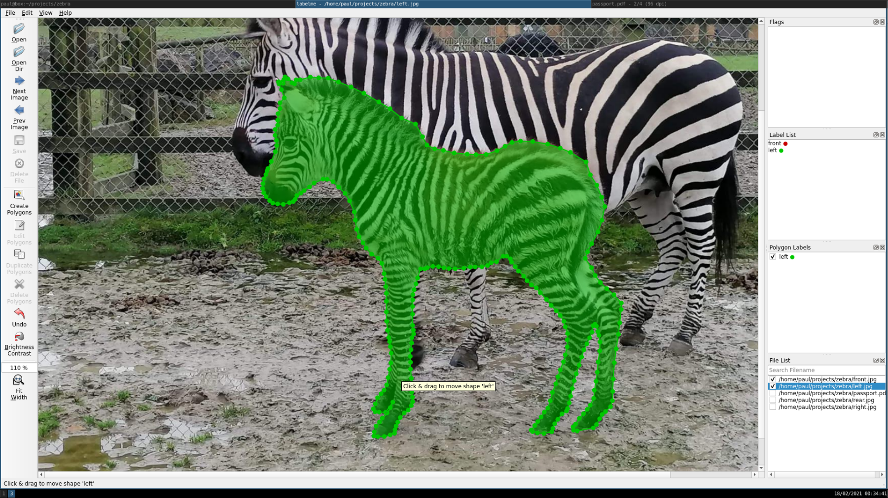
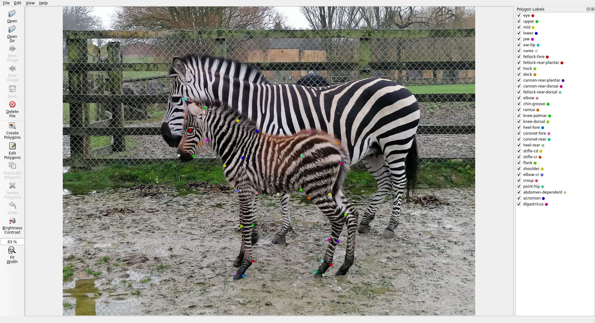
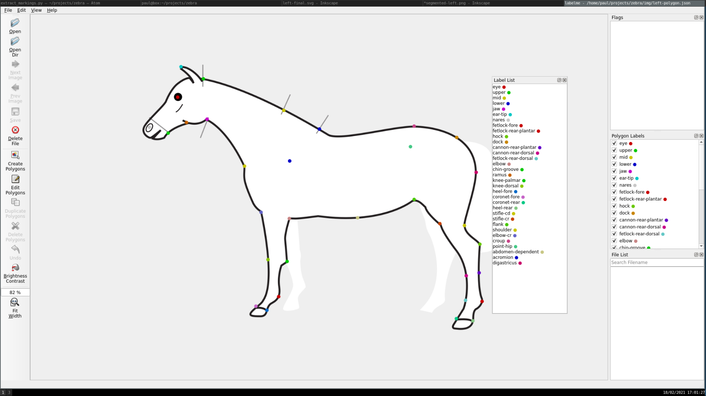
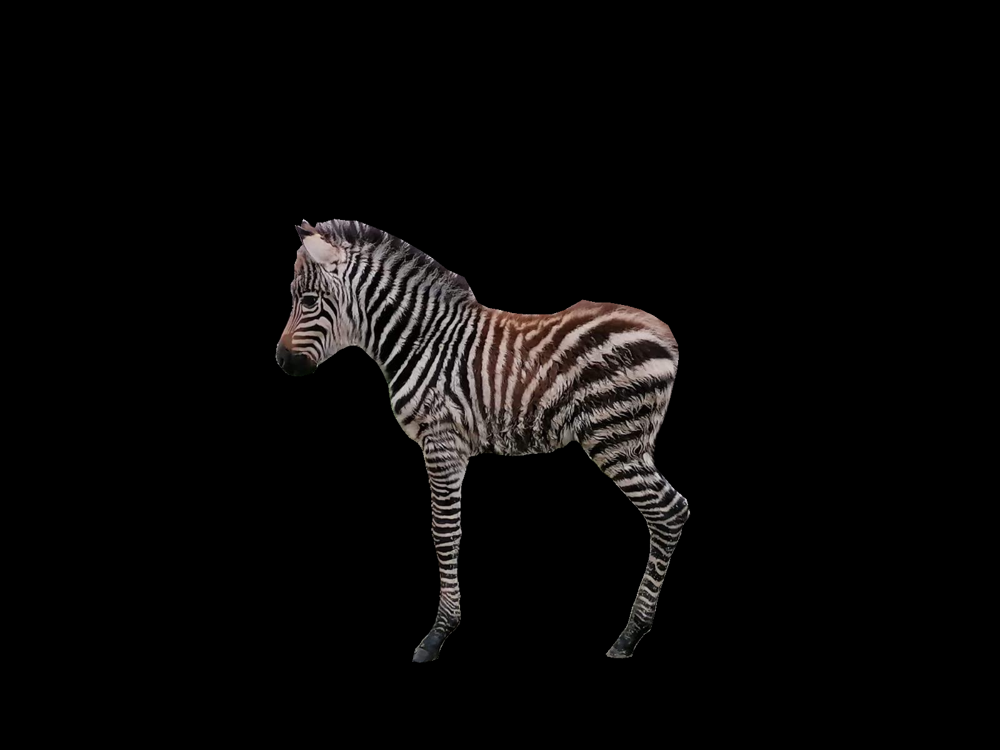
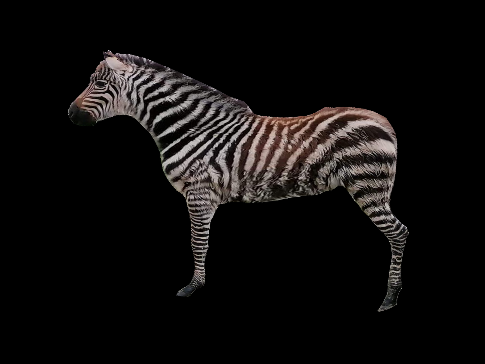
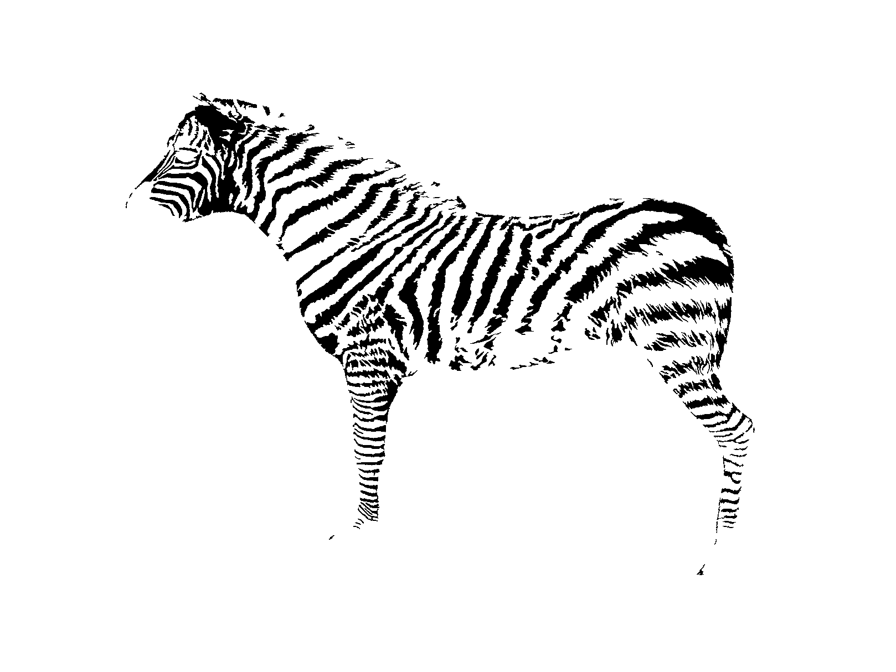
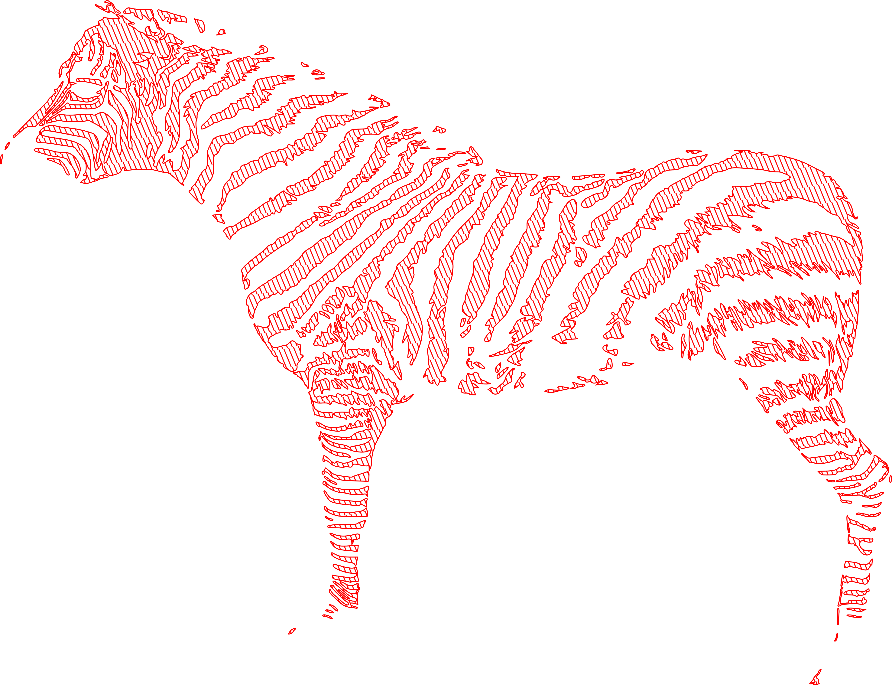
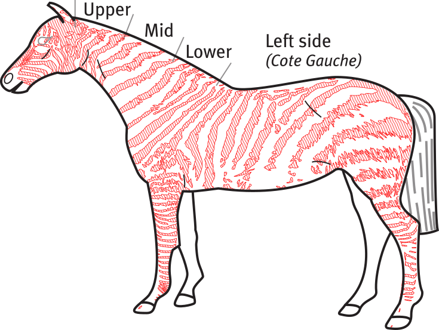

# Silhouette

Creation of Identity documents in Zebra species presents a significant challenge to the veterinary surgeon involved in zoological work. This is due to the requirement for a 'silhouette', a sketch of markings that acts as in addition to the required implanted microchip as a form of individual identification.  The markings in zebra species contain a high density of markings (white regions) that must be annotated on the silhouette.  This results in a time consuming process of recording and transferring of markings onto a standardised outline, where accuracy and reliability of the resulting image are difficult to ensure.

This toolchain aims to aid in the creation of documents conforming to European equid passport regulations in Zebra species. The process consists of three main steps:
- Creation of a mapping between all points on the surface of a provided view of an animal and the standard silhouette outline, while preserving anatomic location and recognisability of the markings.
- Extraction of markings and conversion into vector form to allow colouring and filling of the markings.
- Creation of a correctly annotated silhouete in a passport document.

All software packages used in the process are free and open-source.

## Requirements:
- **Labelme**:
    https://github.com/wkentaro/labelme
    Used to annotate an image to separate only the animal and also to annotate corresponding points between the animal and the silhouette image.
- **ImageJ**:
    https://imagej.net/Fiji
    Perform image warping from animal to silhouette. The BUnwarpJ plugin(included with Fiji) is used to perform a B-spline image deformation.
- **Potrace**:
    http://potrace.sourceforge.net/
    Used to vectorise the binary image of the animals markings.
- **Inkscape**:
    https://inkscape.org
    Used to prepare the silhouette images and finally to clip the resulting vector polygons into the original silhouette and reincorporate into the passport document.
- **Python(3)**:
    https://www.python.org/
    Used for image processing, the following python libraries are also needed can be installed via pip:
 - **PIL** *pip install Pillow*
 - **Scikit-image** *pip install scikit-image*
 - **Numpy** *pip install numpy*
 - **Json** (Built-in)
 - **Base64** (Built-in)

## Workflow:

### Acquire reference images
Take animal images showing markings corresponding to the required views of the passport:
- Left (including the medial surfaces of both contralateral limbs)
- Right (including the medial surfaces of both contralateral limbs)
- Forelimbs - rear
- Hindquarters - rear
- Neck - ventral
- Head - rostral view
- Muzzle
Images should be taken from orientations that as closely match the standard views as possible.  Good, consistent lighting conditions producing relatively homogenous illumination of all parts of the visible anatomy will ensure the best results.

### Segment and annotate
Taking as an example the left side view. The second page of the passport document was opened in inkscape silhouette vectors were extracted ungrouped and separated and saved out to svg files.  These files are stored in the svg directory.

Next, note the image file width and height in pixels of the left side image.  Open the left.svg file in inkscape resize the page to the dimensions of the input image, Scale and centre the silhouette graphics on the page then export the image as a .png file, taking care to choose "Page" as the output.  The exact scale does not matter as long as the whole silhouette is visible in the resulting image.

Put both images in the same folder and start the labelme annotation tool.  Click on open dir and select the folder with the images.  Check the following:

*File->Save Automatically*

*File->Save with image data*

*Edit->Keep annotations*

  Click on create polygon and draw a polygon around the outline of the animal.  Name the polygon as "left", to adjust after creation click on "Edit polygons". This allows the nodes to be repositioned. Shift-click will delete a node and Ctrl-Shift-p to insert a node.
Next choose Edit-> Create Point.

Next, annotate and name the anatomy:

*Edit-> Create Point*

I used the following points, however anything could be used as long as it can be consistent across both images:
- Eye
- Upper (from silhouete)
- Mid (from silhouette)
- Lower (from silhouette)
- Jaw
- Ramus
- Chin groove
- Tip of Pinna
- Nares
- Forelimb
  - Shoulder
  - Acromion
  - Elbow
    - Cr
    - Cd
  - Knee
    - Cr
    - Cd
  - Fetlock
      - Cr
      - Cd
  - Coronet
  - Heel
- Hindlimb
    - Stifle
      - Cr
      - Cd
    - Hock
    - Cannon
         - Cr
         - Cd
    - Fetlock
         - Cr
         - Cd
    - Coronet
    - Heel
- Flank
- Dependent abdomen
- Dock
- Croup
- Biceps femoris

Once this is done change to the silhouette, all previously created points should remain, then it is simply a case of moving the points to align with the appropriate structures depicted in the silhouette image.

### Warp image
Once the annotations are complete you should have two .json files saved in the same folder as the reference images, these contain a copy of the image along with the annotations. The next step is to pass these to a couple of python scripts:

**segment_image.py** Takes the left.json file and removes the background outputting a segmented image:

**generate_landmarks.py** Takes both the .json files and creates a landmark file that we can pass to the **bUnwarpJ** plugin in **ImageJ**.

Following the instructions for **BUnWarpJ** https://imagej.net/BUnwarpJ#User_Manual

Load both images and the landmarks file. For the plugin settings I used:
- Mono
- Very Coarse to Very Fine
- Landmarks: 1.0 and all others settings to 0.0

Generate the morphed image then save it out to a .png file.

### Vectorise

Run the **extract_markings.py** script.  This processes the image in a binary image and performs a couple of morphological transforms to smooth the bands.  An .bmp file is produced.
Internally the program opens the warped image as greyscale and carries out the following operations:
- Threshold the image.
- Perform a diameter opening https://en.wikipedia.org/wiki/Mathematical_morphology#Opening
- Perform a diameter closing https://en.wikipedia.org/wiki/Mathematical_morphology#Closing
- Invert the image

This image was created with a threshold of 0.4, opening diameter of 10 and closing diameter of 20.  These parameters may also need to be altered depending on the image lighting etc.
Note that the white areas appear black on this intermediate image, this is to force the tracing program to create polygons around the white areas that we want to colour in the final image.

Next run the potrace command against this binary image to produce an svg vector image:

*potrace --svg -o left-polygons.svg extracted-closed20.bmp*

The resulting file can be opened in inkscape, a red outline applied to the polygons with a hatch fill.

### Create final image and generate passport document
Finally the polygons can be clipped by the left.svg vector image to create a final result, which can then be integrated back into the passport document:

### Improvements
- On the left view the medial aspect of both limbs on the left view are incomplete. To fix this the final view would need to draw from multiple different input images or additional segmentations should be added to each image to account for each required output component. For example an image could be annotated with left side and right fore medial, right fore medial.

- The silhouette image could be generated automatically from the input image.  Similarly the annotation points could be saved and provided for silhouette and would therefore only need to be placed on the input image.  Similarly, if not all points are provided or additional structures are annotated on both images then the landmark generation script could be updated to deal with these situations.

- The warping plugin can be called directly from the command line, so this part of the process could be automated. Alternatively, the algorithm could be ported into Python or modified replaced to produce a better mapping.

- The post-processing of the warped image could be improved to make the image smoother and more similar to a human generated silhouette.

- All the inkscape manipulations and the insertion of the resulting images into the passport document could also be automated, probably using the Cairo vector imaging library. https://www.cairographics.org/

- Special markings like whorls, the microchip location and other marks could also be added to the annotation phase and be automatically produced on the output.

- Finally, the anatomical point annotation and other feature extraction could be automated or assisted using some machine vision.
